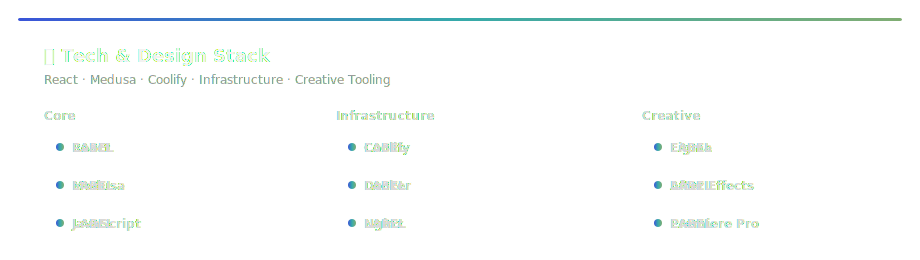

<!-- ===================== HERO ===================== -->

  

  <i>The Swiss Army Knife of Tech & Design</i>

  <i>Loyalty to aesthetics, driven by action.</i>

---

<h2 align="center">🧩 Kariyer Ekosistemi</h2>

Teknoloji, tasarım ve stratejiyi tek bir üretim disiplininde birleştiren çok yönlü bir profesyonelim. 
Denizcilik otomasyonundan kurumsal perakendeye uzanan deneyimimi modern dijital ürün geliştirme anlayışıyla harmanlıyorum.

---

<table align="center">
<tr>
<td width="33%" valign="top">

### 🎨 UI / UX
- Minimalist ve işlevsel arayüzler  
- Tasarım sistemi yaklaşımı  
- Akış, okunabilirlik ve tutarlılık  

</td>
<td width="33%" valign="top">

### 💻 Web
- Bileşen tabanlı mimari  
- Performans ve sürdürülebilirlik  
- Uzun vadeli bakım odağı  

</td>
<td width="33%" valign="top">

### 🚀 Strategy
- Teknik optimizasyon bakışı  
- Dönüşüm odaklı deneyim  
- Ölçülebilir karar alma  

</td>
</tr>
</table>

---

<!-- ===================== STACK SECTION ===================== -->

  

  

---

<h2 align="center">🧠 Çalışma Prensipleri</h2>

Gereksiz karmaşıklığı azaltır, işlevi öne çıkarırım. 
Estetik benim için süs değil, performans aracıdır. 
Ürünü sadece üretmem, sürdürülebilir hale getiririm.

---

<h2 align="center">📌 Seçili Çalışmalar</h2>

En güçlü projelerim, profilimde sabitlenmiş (Pinned) repo’lar üzerinden sergilenmektedir.

---

⌘ Status: <b>TR Mode Active</b>

  
  
  

  

