  

  
   
  

---

<h2 align="center">🧩 Kariyer Ekosistemi / Career Ecosystem</h2>

> [!IMPORTANT]
> **🇹🇷 TR:** Teknoloji, tasarım ve stratejiyi tek bir üretim disiplininde birleştiren çok yönlü bir profesyonelim. Denizcilik otomasyonundan kurumsal perakendeye uzanan deneyimimi modern dijital ürün geliştirme anlayışıyla harmanlıyorum.

> [!NOTE]
> **🇺🇸 EN:** A versatile professional blending technology, design, and strategy. I merge my experience from maritime automation to corporate retail with a modern digital product development approach.

---

  

---

<h2 align="center">🧠 Çalışma Prensipleri / Working Principles</h2>

> [!IMPORTANT]
> **🇹🇷 TR:** Gereksiz karmaşıklığı azaltır, işlevi öne çıkarırım. Estetik benim için bir süs değil, bir performans aracıdır. Ürünü sadece üretmekle kalmaz, sürdürülebilir hale getiririm.

> [!NOTE]
> **🇺🇸 EN:** I reduce unnecessary complexity and prioritize function. For me, aesthetics is not a decoration but a performance tool. I don't just build products; I make them sustainable.

---

  

<h2 align="center">📬 İletişim / Contact</h2>

  <a href="https://celikberkay.com"><b>celikberkay.com</b></a>
  &nbsp;·&nbsp;
  <a href="mailto:infogit@celikberkay.com"><b>infogit@celikberkay.com</b></a>

  

---

  
  
  

  

