<!-- ===================== HERO ===================== -->

  

<!-- ===================== UNIQLEGACY ===================== -->

  

<!-- ===================== TAGLINES ===================== -->

  
   
  

---

<!-- ===================== CAREER ECOSYSTEM ===================== -->
<h2 align="center">🧩 Kariyer Ekosistemi / Career Ecosystem</h2>

<table>
  <tr>
    <td width="65%" valign="top">

Teknoloji, tasarım ve stratejiyi tek bir üretim disiplininde birleştiririm.  
Denizcilik otomasyonundan kurumsal perakendeye uzanan deneyimi,  
modern dijital ürün geliştirme anlayışıyla harmanlarım.

A versatile professional blending technology, design, and strategy —  
merging experience from maritime automation to corporate retail  
with a modern digital product development approach.

  </td>
    <td width="35%" align="right" valign="top">
      
    </td>
  </tr>
</table>

  

---

<!-- ===================== STACK ===================== -->

  

  Built like a casino UI: fast, crisp, and bias-free.

<!-- ===================== SLOT MACHINE ===================== -->

  

---

<!-- ===================== WORKING PRINCIPLES ===================== -->
<h2 align="center">🧠 Çalışma Prensipleri / Working Principles</h2>

Gereksiz karmaşıklığı azaltır, işlevi öne çıkarırım.  
Estetik benim için bir süs değil, bir performans aracıdır.  
Ürünleri sadece üretmem; sürdürülebilir hale getiririm.

I reduce unnecessary complexity and prioritize function.  
Aesthetics is not decoration, but a performance tool.  
I don’t just build products — I make them sustainable.

  

---

<!-- ===================== CONTACT ===================== -->

  <b>celikberkay.com</b>
  &nbsp;·&nbsp;
  <b>infogit@celikberkay.com</b>

  

---

<!-- ===================== STATS ===================== -->

  
  
  

  

