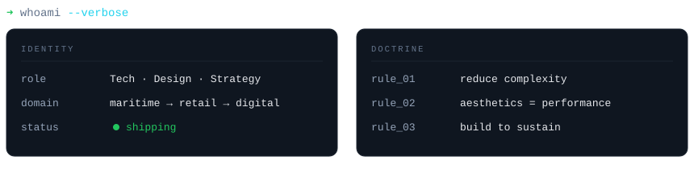

<!-- ===================== BOOT / HERO ===================== -->

  

<!-- ===================== BIOMETRIC SCAN ===================== -->

  

<!-- ===================== WHOAMI ===================== -->

  

<!-- ===================== STACK SCAN ===================== -->

  

<!-- ===================== RNG / CASINO ===================== -->

  

<!-- ===================== PRINCIPLES LOG ===================== -->

  

<!-- ===================== STATUS BAR / CONTACT ===================== -->

  

